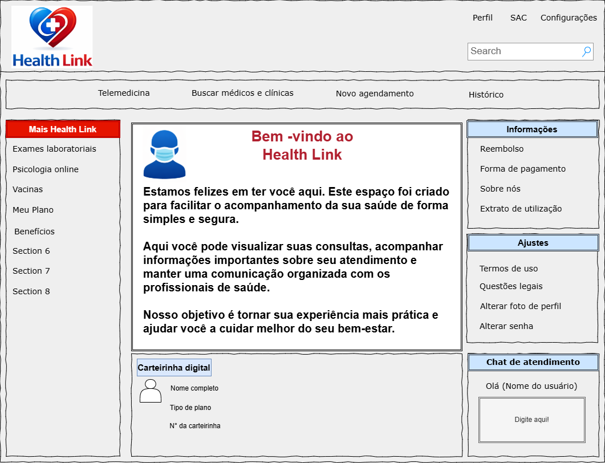
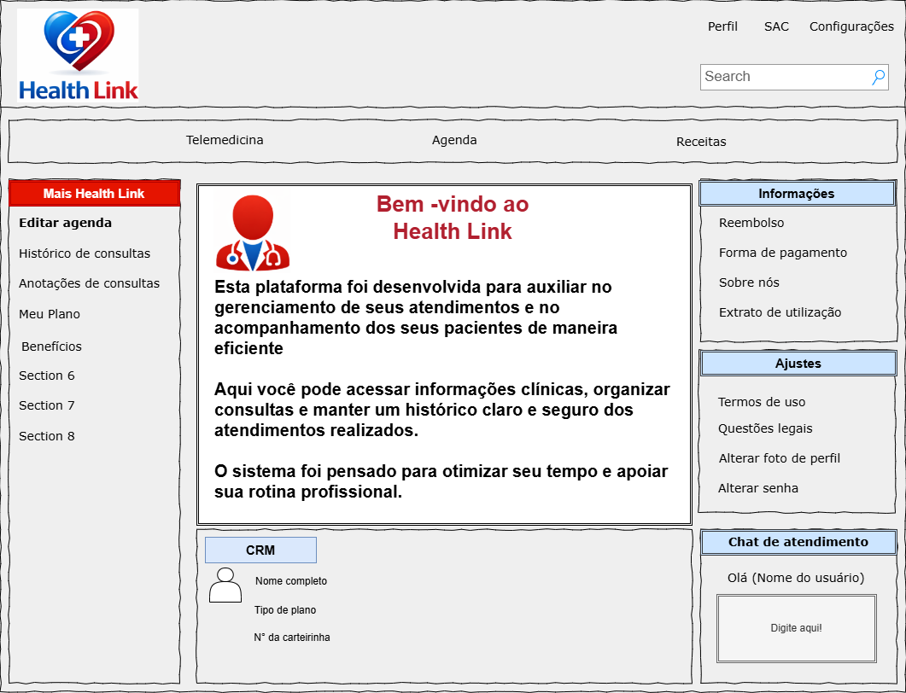
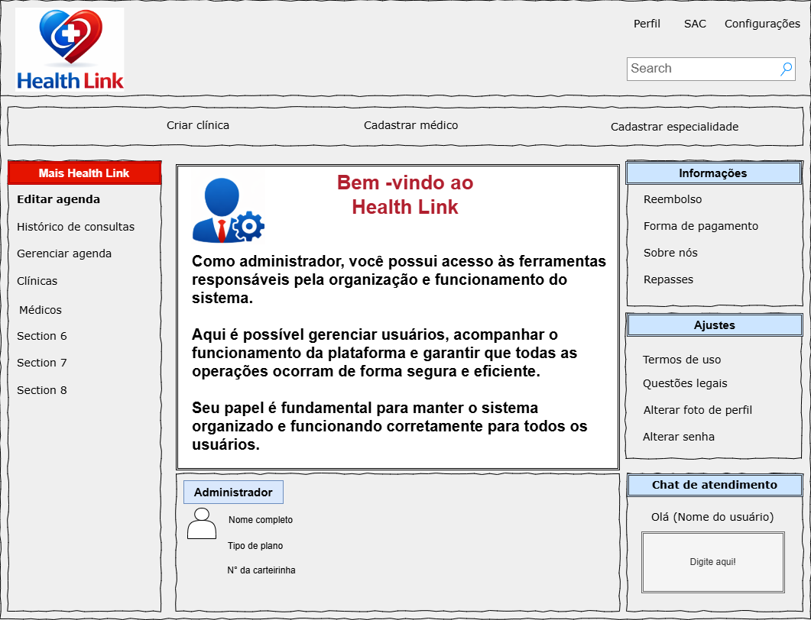

# Documento de visão do produto - *Health Link*

## 1) Visão Geral do Produto

**1.1 Oportunidade de Negócio e Declaração do Problema**

1.	**Problema principal**: O acesso a serviços de saúde ainda apresenta diversas barreiras para grande parte da população. Entre os principais problemas estão a dificuldade de agendamento de consultas, a escassez de especialistas em determinadas regiões e a necessidade de deslocamento físico até clínicas ou hospitais.

Segundo a Organização Mundial da Saúde (OMS), a telemedicina tem sido cada vez mais utilizada como estratégia para melhorar o acesso à saúde, especialmente em locais com limitações geográficas ou infraestrutura insuficiente (WHO, 2019).

Além disso, muitos pacientes possuem dificuldades para manter um histórico organizado de consultas, exames e receitas médicas, o que pode comprometer a continuidade do tratamento e o acompanhamento médico adequado.

2.	**Causas do problema**: 

- Falta de sistemas digitais integrados entre clínicas, médicos e pacientes

- Processos de agendamento ainda realizados manualmente ou por telefone

- Longas filas para consultas presenciais com especialistas

- Dificuldade de acesso à saúde em regiões afastadas

- Falta de centralização de dados médicos do paciente

Esses fatores reduzem a eficiência do atendimento médico e impactam diretamente a experiência do paciente.

3.	**Oportunidade de negócio**: 

A crescente digitalização dos serviços de saúde abre oportunidades para plataformas que facilitem o acesso a consultas médicas e organizem as informações de saúde dos pacientes.

A plataforma HealthLink propõe conectar pacientes, médicos e clínicas por meio de uma solução digital que permite:

- Busca por profissionais de saúde

- Agendamento de consultas online

- Realização de pagamentos para consultas particulares

- Realização de teleconsultas por vídeo

- Centralização do histórico médico do paciente

Esse modelo reduz custos operacionais para clínicas, melhora a experiência do paciente e amplia o alcance dos profissionais de saúde.

4.	**Impacto potencial**: 

A adoção de uma plataforma de telemedicina como a HealthLink pode gerar diversos benefícios:

- Redução do tempo de espera para consultas

- Maior acesso a especialistas, independentemente da localização do paciente

- Melhoria na organização e acesso ao histórico médico

- Otimização da agenda de médicos e clínicas

- Redução de custos operacionais no sistema de saúde

Além disso, soluções digitais de telemedicina contribuem para a modernização do setor de saúde e para a democratização do acesso a serviços médicos.

**1.2 Perspectiva do Produto**

1. *Contexto no Ecossistema Tecnológico*

A plataforma HealthLink se insere no ecossistema de sistemas digitais de saúde (Digital Health), que inclui prontuários eletrônicos, plataformas de agendamento médico e soluções de teleconsulta.

Atualmente existem sistemas semelhantes no mercado, porém muitos deles oferecem apenas funcionalidades isoladas, como:

- apenas agendamento online

- apenas teleconsulta

- apenas prontuário eletrônico

A HealthLink busca integrar essas funcionalidades em uma única plataforma.

Além disso, o sistema poderá se integrar a serviços externos como:

- plataformas de videoconferência para teleconsultas

- serviços de envio de e-mails

- sistemas de pagamento online

2. *Público-alvo:* 

Os principais usuários da plataforma são:

- **Pacientes:** pessoas que desejam agendar consultas médicas e acompanhar seu histórico de saúde

- **Médicos:** profissionais que realizam consultas presenciais ou remotas

- **Administradores de clínicas:** responsáveis pela gestão da clínica, cadastro de médicos e controle de agendas

3.  *Proposta de valor:* 

A HealthLink oferece uma solução integrada que permite:

- acesso rápido a profissionais de saúde

- facilidade no agendamento de consultas

- consultas médicas por vídeo

- centralização de histórico médico

Diferentemente de sistemas tradicionais, a plataforma reúne gestão de clínicas, agendamento, teleconsulta e histórico médico em um único ambiente, melhorando a experiência de pacientes e profissionais de saúde.

**1.3 Capacidades do Produto**

1. *Principais funcionalidades:* 

A plataforma HealthLink oferecerá as seguintes funcionalidades principais:

**Gestão de Clínicas:**

- Cadastro de clínicas no sistema

- Gerenciamento de médicos e especialidades

- Visualização de relatórios de consultas

**Gestão de Médicos:**

- Configuração da agenda de atendimentos

- Visualização de consultas agendadas

- Registro de anotações médicas

- Emissão de receitas digitais

**Funcionalidades para Pacientes:**

- Busca de médicos por especialidade

- Agendamento de consultas

- Participação em teleconsultas

- Acesso ao histórico de consultas

- Visualização de receitas e orientações médicas

**Comunicação:**

- Envio de e-mails de confirmação

- Lembretes automáticos de consultas

2. *Wireframes:*
### Paciente:

### Médico:

### Administrador:

3. *Características de qualidade:* 

**Usabilidade**

O sistema deve possuir interface simples e intuitiva, permitindo que usuários com baixo nível técnico consigam utilizar a plataforma facilmente.

**Segurança**

Devido à natureza sensível das informações médicas, o sistema deve garantir:

- autenticação segura de usuários

- controle de acesso baseado em papéis

- proteção de dados dos pacientes

**Confiabilidade**

A plataforma deve garantir alta disponibilidade durante o horário comercial, evitando interrupções em consultas online.

**Manutenibilidade**

O sistema deve ser desenvolvido com arquitetura modular, permitindo futuras atualizações e melhorias sem grandes impactos na plataforma.

## 2) Definição de usuários

### Paciente
| Atributo              | Descrição                                                                                              |
| --------------------- | ------------------------------------------------------------------------------------------------------ |
| Usuário ID            | USER-001                                                                                               |
| Nome do Perfil        | Paciente                                                                                               |
| Descrição             | Pessoa que utiliza a plataforma para buscar médicos, agendar consultas e acessar seu histórico médico. |
| Experiência Técnica   | Baixa a média; pode ter pouca familiaridade com tecnologia.                                            |
| Frequência de Uso     | Eventual, geralmente quando precisa marcar ou realizar consultas.                                      |
| Principais Objetivos  | Encontrar médicos, agendar consultas e acompanhar seu histórico de saúde.                              |
| Desafios              | Dificuldade em encontrar especialistas disponíveis rapidamente.                                        |
| Restrições            | Só pode acessar suas próprias informações médicas.                                                     |
| Requisitos Principais | Agendamento simples, acesso ao histórico e participação em teleconsultas.                              |

### Médico
| Atributo              | Descrição                                                                                      |
| --------------------- | ---------------------------------------------------------------------------------------------- |
| Usuário ID            | USER-002                                                                                       |
| Nome do Perfil        | Médico                                                                                         |
| Descrição             | Profissional de saúde responsável por atender pacientes e registrar informações das consultas. |
| Experiência Técnica   | Média; familiaridade com sistemas médicos digitais.                                            |
| Frequência de Uso     | Alta, utilizando o sistema diariamente para consultas.                                         |
| Principais Objetivos  | Gerenciar agenda, atender pacientes e registrar consultas.                                     |
| Desafios              | Necessidade de acesso rápido ao histórico do paciente.                                         |
| Restrições            | Só pode acessar dados dos pacientes que atende.                                                |
| Requisitos Principais | Agenda organizada, teleconsulta e registro de prontuários.                                     |

### Administrador da clínica
| Atributo              | Descrição                                                 |
| --------------------- | --------------------------------------------------------- |
| Usuário ID            | USER-003                                                  |
| Nome do Perfil        | Administrador da Clínica                                  |
| Descrição             | Responsável pela gestão da clínica dentro da plataforma.  |
| Experiência Técnica   | Média a alta.                                             |
| Frequência de Uso     | Regular, para gerenciamento da clínica.                   |
| Principais Objetivos  | Gerenciar médicos, horários e relatórios de consultas.    |
| Desafios              | Manter organização das agendas e controle administrativo. |
| Restrições            | Não pode acessar prontuários de pacientes.                |
| Requisitos Principais | Painel administrativo e relatórios de consultas.          |

## 3) Restrições do projeto

| Campo                                | Descrição                                                                                   |
| ------------------------------------ | ------------------------------------------------------------------------------------------- |
| Restrição ID                         | NF-CONST-001                                                                                |
| Título                               | Restrições Tecnológicas                                                                     |
| Descrição                            | O sistema deve ser desenvolvido como aplicação web utilizando arquitetura cliente-servidor. |
| Origem                               | Equipe de desenvolvimento                                                                   |
| Critérios de verificação e validação | O sistema deve operar em navegadores modernos e suportar integração com serviços externos.  |
| Relacionamento com outros requisitos | Relacionado aos requisitos de teleconsulta e envio de notificações.                         |

| Campo                                | Descrição                                                                          |
| ------------------------------------ | ---------------------------------------------------------------------------------- |
| Restrição ID                         | NF-CONST-002                                                                       |
| Título                               | Prazo de desenvolvimento                                                           |
| Descrição                            | O sistema deve ser desenvolvido dentro do período definido pelo projeto acadêmico. |
| Origem                               | Planejamento do projeto                                                            |
| Critérios de verificação e validação | Entrega das funcionalidades principais dentro do cronograma.                       |

| Campo                                | Descrição                                                                             |
| ------------------------------------ | ------------------------------------------------------------------------------------- |
| Restrição ID                         | NF-CONST-003                                                                          |
| Título                               | Segurança de dados                                                                    |
| Descrição                            | Informações médicas devem ser protegidas e acessadas apenas por usuários autorizados. |
| Origem                               | Requisitos de privacidade e segurança                                                 |
| Critérios de verificação e validação | Implementação de autenticação e controle de acesso baseado em papéis.                 |

## 4) Riscos do projeto

| Campo                 | Descrição                                                          |
| --------------------- | ------------------------------------------------------------------ |
| ID do Risco           | RISCO-001                                                          |
| Descrição             | Conexão de internet instável prejudicar teleconsultas              |
| Categoria             | Técnico                                                            |
| Probabilidade         | Média                                                              |
| Impacto               | Alto                                                               |
| Ação de Mitigação     | Utilizar plataforma de vídeo otimizada para baixa largura de banda |
| Plano de Contingência | Permitir reagendamento da consulta                                 |

| Campo                 | Descrição                                                 |
| --------------------- | --------------------------------------------------------- |
| ID do Risco           | RISCO-002                                                 |
| Descrição             | Conflitos de agenda entre consultas                       |
| Categoria             | Técnico                                                   |
| Probabilidade         | Média                                                     |
| Impacto               | Alto                                                      |
| Ação de Mitigação     | Implementar bloqueio automático de horários já reservados |
| Plano de Contingência | Notificar usuários e permitir reagendamento               |

| Campo                 | Descrição                                                       |
| --------------------- | --------------------------------------------------------------- |
| ID do Risco           | RISCO-003                                                       |
| Descrição             | Acesso não autorizado a dados médicos                           |
| Categoria             | Segurança                                                       |
| Probabilidade         | Baixa                                                           |
| Impacto               | Muito alto                                                      |
| Ação de Mitigação     | Implementar autenticação segura e controle de acesso por perfil |
| Plano de Contingência | Auditoria de acesso e bloqueio imediato da conta                |

