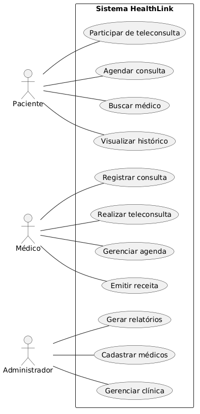

# Documento de Requisitos – HealthLink

## 1. Introdução

Este documento apresenta os requisitos funcionais e não funcionais do sistema **HealthLink**, uma plataforma de telemedicina.

---

## 2. Atores do Sistema

* **Paciente**
* **Médico**
* **Administrador da Clínica**

---

## 3. Requisitos Funcionais (MoSCoW)

| ID     | Requisito          | Prioridade  |
| ------ | ------------------ | ----------- |
| RF-001 | Gerenciar Clínica  | Must Have   |
| RF-002 | Cadastrar Médicos  | Must Have   |
| RF-003 | Configurar Agenda  | Must Have   |
| RF-004 | Buscar Médicos     | Must Have   |
| RF-005 | Agendar Consulta   | Must Have   |
| RF-006 | Teleconsulta       | Must Have   |
| RF-007 | Registrar Consulta | Must Have   |
| RF-008 | Emitir Receita     | Should Have |
| RF-009 | Histórico Médico   | Must Have   |
| RF-010 | Notificações       | Should Have |
| RF-011 | Relatórios         | Could Have  |

---

## 4. Requisitos Não Funcionais

* Tempo de resposta de até 2 segundos
* Segurança e controle de acesso
* Disponibilidade de 99%
* Escalabilidade para até 5.000 usuários
* Interface intuitiva
* Compatibilidade Web e Mobile
* Qualidade de teleconsulta

---

# Requisitos Funcionais

## RF-001 — Gerenciar Clínica

| Campo                  | Descrição                                                |
| ---------------------- | -------------------------------------------------------- |
| Requisito ID           | RF-001                                                   |
| Nome                   | Gerenciar Clínica                                        |
| Descrição              | Administrador executa a funcionalidade Gerenciar Clínica |
| Extensões              | Fluxos alternativos possíveis                            |
| Critérios de Aceitação | Funcionalidade executada com sucesso                     |
| Dependências           | Usuário autenticado                                      |
| Fonte                  | Administrador                                            |
| Prioridade             | Must Have                                                |

---

## RF-002 — Cadastrar Médicos

| Campo                  | Descrição                                                |
| ---------------------- | -------------------------------------------------------- |
| Requisito ID           | RF-002                                                   |
| Nome                   | Cadastrar Médicos                                        |
| Descrição              | Administrador executa a funcionalidade Cadastrar Médicos |
| Extensões              | Fluxos alternativos possíveis                            |
| Critérios de Aceitação | Funcionalidade executada com sucesso                     |
| Dependências           | Usuário autenticado                                      |
| Fonte                  | Administrador                                            |
| Prioridade             | Must Have                                                |

---

## RF-003 — Configurar Agenda

| Campo                  | Descrição                                         |
| ---------------------- | ------------------------------------------------- |
| Requisito ID           | RF-003                                            |
| Nome                   | Configurar Agenda                                 |
| Descrição              | Médico executa a funcionalidade Configurar Agenda |
| Extensões              | Fluxos alternativos possíveis                     |
| Critérios de Aceitação | Funcionalidade executada com sucesso              |
| Dependências           | Usuário autenticado                               |
| Fonte                  | Médico                                            |
| Prioridade             | Must Have                                         |

---

## RF-004 — Buscar Médicos

| Campo                  | Descrição                                        |
| ---------------------- | ------------------------------------------------ |
| Requisito ID           | RF-004                                           |
| Nome                   | Buscar Médicos                                   |
| Descrição              | Paciente executa a funcionalidade Buscar Médicos |
| Extensões              | Fluxos alternativos possíveis                    |
| Critérios de Aceitação | Funcionalidade executada com sucesso             |
| Dependências           | Usuário autenticado                              |
| Fonte                  | Paciente                                         |
| Prioridade             | Must Have                                        |

---

## RF-005 — Agendar Consulta

| Campo                  | Descrição                                          |
| ---------------------- | -------------------------------------------------- |
| Requisito ID           | RF-005                                             |
| Nome                   | Agendar Consulta                                   |
| Descrição              | Paciente executa a funcionalidade Agendar Consulta |
| Extensões              | Fluxos alternativos possíveis                      |
| Critérios de Aceitação | Funcionalidade executada com sucesso               |
| Dependências           | Usuário autenticado                                |
| Fonte                  | Paciente                                           |
| Prioridade             | Must Have                                          |

---

## RF-006 — Teleconsulta

| Campo                  | Descrição                                             |
| ---------------------- | ----------------------------------------------------- |
| Requisito ID           | RF-006                                                |
| Nome                   | Teleconsulta                                          |
| Descrição              | Paciente/Médico executa a funcionalidade Teleconsulta |
| Extensões              | Fluxos alternativos possíveis                         |
| Critérios de Aceitação | Funcionalidade executada com sucesso                  |
| Dependências           | Usuário autenticado                                   |
| Fonte                  | Paciente/Médico                                       |
| Prioridade             | Must Have                                             |

---

## RF-007 — Registrar Consulta

| Campo                  | Descrição                                          |
| ---------------------- | -------------------------------------------------- |
| Requisito ID           | RF-007                                             |
| Nome                   | Registrar Consulta                                 |
| Descrição              | Médico executa a funcionalidade Registrar Consulta |
| Extensões              | Fluxos alternativos possíveis                      |
| Critérios de Aceitação | Funcionalidade executada com sucesso               |
| Dependências           | Usuário autenticado                                |
| Fonte                  | Médico                                             |
| Prioridade             | Must Have                                          |

---

## RF-008 — Emitir Receita

| Campo                  | Descrição                                      |
| ---------------------- | ---------------------------------------------- |
| Requisito ID           | RF-008                                         |
| Nome                   | Emitir Receita                                 |
| Descrição              | Médico executa a funcionalidade Emitir Receita |
| Extensões              | Fluxos alternativos possíveis                  |
| Critérios de Aceitação | Funcionalidade executada com sucesso           |
| Dependências           | Usuário autenticado                            |
| Fonte                  | Médico                                         |
| Prioridade             | Should Have                                    |

---

## RF-009 — Histórico Médico

| Campo                  | Descrição                                          |
| ---------------------- | -------------------------------------------------- |
| Requisito ID           | RF-009                                             |
| Nome                   | Histórico Médico                                   |
| Descrição              | Paciente executa a funcionalidade Histórico Médico |
| Extensões              | Fluxos alternativos possíveis                      |
| Critérios de Aceitação | Funcionalidade executada com sucesso               |
| Dependências           | Usuário autenticado                                |
| Fonte                  | Paciente                                           |
| Prioridade             | Must Have                                          |

---

## RF-010 — Notificações

| Campo                  | Descrição                                     |
| ---------------------- | --------------------------------------------- |
| Requisito ID           | RF-010                                        |
| Nome                   | Notificações                                  |
| Descrição              | Sistema executa a funcionalidade Notificações |
| Extensões              | Fluxos alternativos possíveis                 |
| Critérios de Aceitação | Funcionalidade executada com sucesso          |
| Dependências           | Usuário autenticado                           |
| Fonte                  | Sistema                                       |
| Prioridade             | Should Have                                   |

---

## RF-011 — Relatórios

| Campo                  | Descrição                                         |
| ---------------------- | ------------------------------------------------- |
| Requisito ID           | RF-011                                            |
| Nome                   | Relatórios                                        |
| Descrição              | Administrador executa a funcionalidade Relatórios |
| Extensões              | Fluxos alternativos possíveis                     |
| Critérios de Aceitação | Funcionalidade executada com sucesso              |
| Dependências           | Usuário autenticado                               |
| Fonte                  | Administrador                                     |
| Prioridade             | Could Have                                        |

---

# Requisitos Não Funcionais

## NF-001 — Tempo de Resposta

| Campo                  | Descrição                          |
| ---------------------- | ---------------------------------- |
| Requisito ID           | NF-001                             |
| Título                 | Tempo de Resposta                  |
| Descrição              | Sistema responde em até 2 segundos |
| Entrada                | Ação do usuário                    |
| Processamento          | Sistema processa                   |
| Saída                  | Resultado exibido                  |
| Restrições             | Ambiente do sistema                |
| Critérios de Aceitação | Requisito atendido                 |

---

## NF-002 — Segurança

| Campo                  | Descrição                              |
| ---------------------- | -------------------------------------- |
| Requisito ID           | NF-002                                 |
| Título                 | Segurança                              |
| Descrição              | Proteção de dados e controle de acesso |
| Entrada                | Ação do usuário                        |
| Processamento          | Sistema processa                       |
| Saída                  | Resultado exibido                      |
| Restrições             | Ambiente do sistema                    |
| Critérios de Aceitação | Requisito atendido                     |

---

## NF-003 — Disponibilidade

| Campo                  | Descrição                       |
| ---------------------- | ------------------------------- |
| Requisito ID           | NF-003                          |
| Título                 | Disponibilidade                 |
| Descrição              | Sistema disponível 99% do tempo |
| Entrada                | Ação do usuário                 |
| Processamento          | Sistema processa                |
| Saída                  | Resultado exibido               |
| Restrições             | Ambiente do sistema             |
| Critérios de Aceitação | Requisito atendido              |

---

## NF-004 — Escalabilidade

| Campo                  | Descrição                   |
| ---------------------- | --------------------------- |
| Requisito ID           | NF-004                      |
| Título                 | Escalabilidade              |
| Descrição              | Suporte a até 5000 usuários |
| Entrada                | Ação do usuário             |
| Processamento          | Sistema processa            |
| Saída                  | Resultado exibido           |
| Restrições             | Ambiente do sistema         |
| Critérios de Aceitação | Requisito atendido          |

---

## NF-005 — Usabilidade

| Campo                  | Descrição           |
| ---------------------- | ------------------- |
| Requisito ID           | NF-005              |
| Título                 | Usabilidade         |
| Descrição              | Interface simples   |
| Entrada                | Ação do usuário     |
| Processamento          | Sistema processa    |
| Saída                  | Resultado exibido   |
| Restrições             | Ambiente do sistema |
| Critérios de Aceitação | Requisito atendido  |

---

## NF-006 — Compatibilidade

| Campo                  | Descrição           |
| ---------------------- | ------------------- |
| Requisito ID           | NF-006              |
| Título                 | Compatibilidade     |
| Descrição              | Web e Mobile        |
| Entrada                | Ação do usuário     |
| Processamento          | Sistema processa    |
| Saída                  | Resultado exibido   |
| Restrições             | Ambiente do sistema |
| Critérios de Aceitação | Requisito atendido  |

---

## NF-007 — Teleconsulta

| Campo                  | Descrição                  |
| ---------------------- | -------------------------- |
| Requisito ID           | NF-007                     |
| Título                 | Teleconsulta               |
| Descrição              | Qualidade de vídeo estável |
| Entrada                | Ação do usuário            |
| Processamento          | Sistema processa           |
| Saída                  | Resultado exibido          |
| Restrições             | Ambiente do sistema        |
| Critérios de Aceitação | Requisito atendido         |

---

# Diagrama de Casos de Uso

