# 1. Diagrama de Classes

O diagrama abaixo modela as classes envolvidas nas três fatias selecionadas. Classes que aparecem em mais de uma fatia entram uma única vez, com todos os atributos e métodos consolidados.

## 1.1 Diagrama

```mermaid
classDiagram
    direction TB

    class Usuario {
        <<abstract>>
        +id: UUID
        +nome: String
        +email: String
        +senha: String [hashed]
        +telefone: String
        +dataCadastro: Date
        +autenticar(email, senha) Boolean
        +atualizarPerfil(dados) void
    }

    class Paciente {
        +cpf: String
        +dataNascimento: Date
        +cartaoSaude: String
        +buscarMedicos(especialidade, localidade) List~Medico~
        +agendarConsulta(slot, tipo) Consulta
        +visualizarHistorico() List~Consulta~
        +acessarReceitas() List~Receita~
    }

    class Medico {
        +crm: String
        +especialidade: String
        +clinicaId: UUID
        +valorConsulta: Decimal
        +configurarAgenda(slots) void
        +visualizarConsultasAgendadas() List~Consulta~
        +iniciarTeleconsulta(consultaId) SalaVideo
        +registrarAnotacao(consultaId, texto) Anotacao
        +emitirReceita(consultaId, itens) Receita
    }

    class Administrador {
        +clinicaId: UUID
        +criarClinica(dados) Clinica
        +cadastrarMedico(dados) Medico
        +gerenciarHorarios(medicoId) void
        +visualizarRelatorios() Relatorio
    }

    class Clinica {
        +id: UUID
        +nome: String
        +cnpj: String
        +endereco: String
        +especialidades: List~String~
        +telefone: String
        +adicionarMedico(medico) void
        +removerMedico(medicoId) void
        +listarMedicos() List~Medico~
    }

    class Agenda {
        +id: UUID
        +medicoId: UUID
        +slots: List~SlotDisponivel~
        +adicionarSlot(data, hora, duracao) SlotDisponivel
        +removerSlot(slotId) void
        +verificarDisponibilidade(data, hora) Boolean
        +bloquearSlot(slotId) void
        +liberarSlot(slotId) void
    }

    class SlotDisponivel {
        +id: UUID
        +agendaId: UUID
        +dataHoraInicio: DateTime
        +dataHoraFim: DateTime
        +disponivel: Boolean
        +tipoAtendimento: TipoAtendimento
        +reservar() void
        +liberar() void
        +estaDisponivel() Boolean
    }

    class Consulta {
        +id: UUID
        +pacienteId: UUID
        +medicoId: UUID
        +slotId: UUID
        +tipo: TipoAtendimento
        +status: StatusConsulta
        +dataAgendamento: DateTime
        +dataRealizacao: DateTime
        +motivoCancelamento: String
        +confirmar() void
        +iniciar() void
        +concluir() void
        +cancelar(motivo) void
        +podeCancelar() Boolean
        +tempoRestanteParaCancelamento() Duration
    }

    class Teleconsulta {
        +id: UUID
        +consultaId: UUID
        +salaId: String
        +linkPaciente: String
        +linkMedico: String
        +dataHoraInicio: DateTime
        +dataHoraFim: DateTime
        +status: StatusSala
        +criarSala() void
        +encerrarSala() void
        +gerarLinks() void
        +registrarDuracao() Duration
    }

    class Prontuario {
        +id: UUID
        +pacienteId: UUID
        +anotacoes: List~Anotacao~
        +receitas: List~Receita~
        +adicionarAnotacao(anotacao) void
        +adicionarReceita(receita) void
        +historico() List~Consulta~
    }

    class Anotacao {
        +id: UUID
        +consultaId: UUID
        +medicoId: UUID
        +texto: String
        +dataRegistro: DateTime
        +diagnostico: String
        +observacoes: String
        +editar(texto) void
        +obterConsulta() Consulta
    }

    class Receita {
        +id: UUID
        +consultaId: UUID
        +medicoId: UUID
        +pacienteId: UUID
        +dataEmissao: DateTime
        +validade: Date
        +itens: List~ItemReceita~
        +assinada: Boolean
        +assinar() void
        +gerar() ByteArray
        +enviarParaPaciente() void
    }

    class ItemReceita {
        +id: UUID
        +receitaId: UUID
        +medicamento: String
        +dosagem: String
        +posologia: String
        +quantidade: Integer
        +observacoes: String
    }

    class ServicoNotificacao {
        <<interface>>
        +enviarConfirmacaoAgendamento(consulta) void
        +enviarLembrete(consulta, antecedencia) void
        +enviarCancelamento(consulta) void
    }

    class ServicoVideo {
        <<interface>>
        +criarSala(consultaId) String
        +gerarLinkParticipante(salaId, papel) String
        +encerrarSala(salaId) void
        +verificarQualidade(salaId) StatusConexao
    }

    class TipoAtendimento {
        <<enumeration>>
        PRESENCIAL
        TELECONSULTA
    }

    class StatusConsulta {
        <<enumeration>>
        AGENDADA
        CONFIRMADA
        EM_ANDAMENTO
        CONCLUIDA
        CANCELADA
        NAO_REALIZADA
    }

    class StatusSala {
        <<enumeration>>
        AGUARDANDO
        EM_ANDAMENTO
        ENCERRADA
    }

    %% Herança
    Usuario <|-- Paciente
    Usuario <|-- Medico
    Usuario <|-- Administrador

    %% Associações
    Clinica "1" --> "1..*" Medico : emprega
    Administrador "1" --> "1" Clinica : gerencia
    Medico "1" --> "1" Agenda : possui
    Agenda "1" *-- "0..*" SlotDisponivel : composta por

    Paciente "1" --> "0..*" Consulta : realiza
    Medico "1" --> "0..*" Consulta : atende
    SlotDisponivel "1" --> "0..1" Consulta : reservado em

    Consulta "1" --> "0..1" Teleconsulta : possui
    Consulta "1" --> "0..1" Anotacao : gera
    Consulta "1" --> "0..1" Receita : origina

    Paciente "1" --> "1" Prontuario : tem
    Prontuario "1" *-- "0..*" Anotacao : contém
    Prontuario "1" *-- "0..*" Receita : contém

    Receita "1" *-- "1..*" ItemReceita : composta por

    Teleconsulta ..> ServicoVideo : usa
    Consulta ..> ServicoNotificacao : dispara
```

## 1.2 Decisões de Design

**Herança de `Usuario`:** Os três atores (Paciente, Médico, Administrador) compartilham atributos de autenticação e perfil. Usar herança evita duplicação e permite tratar qualquer usuário de forma uniforme para autenticação.

**`SlotDisponivel` como entidade separada:** Em vez de armazenar disponibilidade como simples lista de horários no Médico, criamos uma entidade com estado (`disponivel: Boolean`). Isso permite bloquear o slot atomicamente durante o agendamento, prevenindo double-booking.

**`Teleconsulta` separada de `Consulta`:** Uma `Consulta` pode ser presencial. Apenas consultas do tipo `TELECONSULTA` possuem uma `Teleconsulta` associada (relação 0..1). Isso evita atributos nulos em consultas presenciais.

**`Prontuario` como agregador:** O prontuário é o único ponto de acesso ao histórico clínico do paciente. Isso facilita o controle de acesso — o médico acessa `Anotacao` e `Receita` sempre via `Consulta`, nunca diretamente via prontuário de forma irrestrita.

**`ServicoVideo` e `ServicoNotificacao` como interfaces:** Desacopla o sistema de provedores externos específicos (ex.: Twilio, SendGrid). O sistema depende da abstração, não da implementação.
