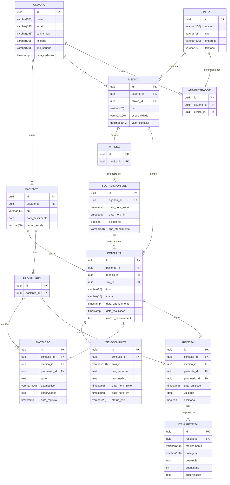

# 2. Modelo Entidade-Relacionamento (MER)

O MER abaixo contempla apenas as entidades persistentes das três fatias modeladas. Notação Crow's Foot (usada consistentemente ao longo do documento).

## 2.1 Diagrama

## 2.2 Decisões e Divergências em Relação ao Diagrama de Classes

### Herança → Tabela por subclasse

No diagrama de classes, `Paciente`, `Medico` e `Administrador` herdam de `Usuario`. No MER, optamos pela estratégia de **tabela por subclasse**: uma tabela `USUARIO` contém os atributos comuns (autenticação, nome, email) e cada subclasse tem sua própria tabela com chave estrangeira apontando para `USUARIO`.

Essa escolha foi feita porque cada subclasse tem atributos específicos relevantes (CRM para médico, CPF para paciente) e as consultas por tipo de ator são frequentes e precisam ser eficientes. A alternativa (tabela única com discriminador) geraria muitas colunas nulas.

### Atributos calculados — não persistidos

O método `tempoRestanteParaCancelamento()` na classe `Consulta` é derivado de `data_realizacao` menos o instante atual. Não é persistido no banco — é calculado em tempo de execução. Da mesma forma, a duração da teleconsulta é derivada de `data_hora_inicio` e `data_hora_fim` da `TELECONSULTA`.

### `PRONTUARIO` como tabela explícita

No diagrama de classes, `Prontuario` é um agregador lógico. No MER, materializamos como tabela pois serve como raiz de acesso para controle de permissão — toda leitura de `ANOTACAO` ou `RECEITA` pode verificar se o `prontuario_id` pertence ao paciente do médico em atendimento, centralizando a lógica de autorização.

### Relacionamento N:N — não ocorre neste modelo

Não há relacionamentos muitos-para-muitos neste recorte, pois um `SLOT_DISPONIVEL` pertence a apenas uma `CONSULTA` e uma `Consulta` gera no máximo uma `Receita`. Portanto, não foi necessária tabela associativa.
