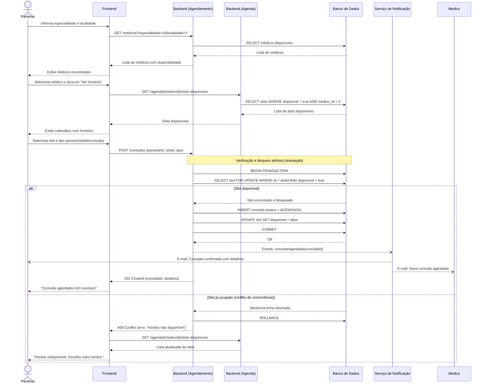

# 3. Modelagem Comportamental — Fatia 1

## Fatia 1: Paciente busca médico e agenda consulta

**Tipo de diagrama escolhido: Diagrama de Sequência**

**Justificativa:** Escolhemos o diagrama de sequência para esta fatia porque ela envolve coordenação entre múltiplos componentes em ordem temporal precisa: o paciente interage com o frontend, que aciona o backend, que consulta a agenda do médico e, ao confirmar o agendamento, dispara o serviço de notificação. Existe ainda um caminho crítico de erro (slot já ocupado por concorrência) que é melhor visualizado com fragmentos `alt`. Um diagrama de estados seria menos adequado aqui porque o foco não é o ciclo de vida de um objeto, mas a troca de mensagens entre participantes.

---

## Diagrama de Sequência

---

## Notas sobre o diagrama

**Transação atômica:** O passo crítico de verificação e reserva do slot é executado dentro de uma transação com `SELECT FOR UPDATE` para garantir que dois pacientes não reservem o mesmo horário simultaneamente. Isso é a regra de negócio mais importante desta fatia.

**Notificações assíncronas:** As notificações (E-mails) são disparadas como eventos assíncronos (`--)` em vez de chamadas síncronas. Isso evita que uma falha no serviço de e-mail impeça a confirmação do agendamento.

**Atores envolvidos:** Paciente, Frontend, dois módulos de backend (separados por domínio), Banco de Dados e Serviço de Notificação — demonstrando a interação entre múltiplos componentes exigida pela seleção de escopo.
