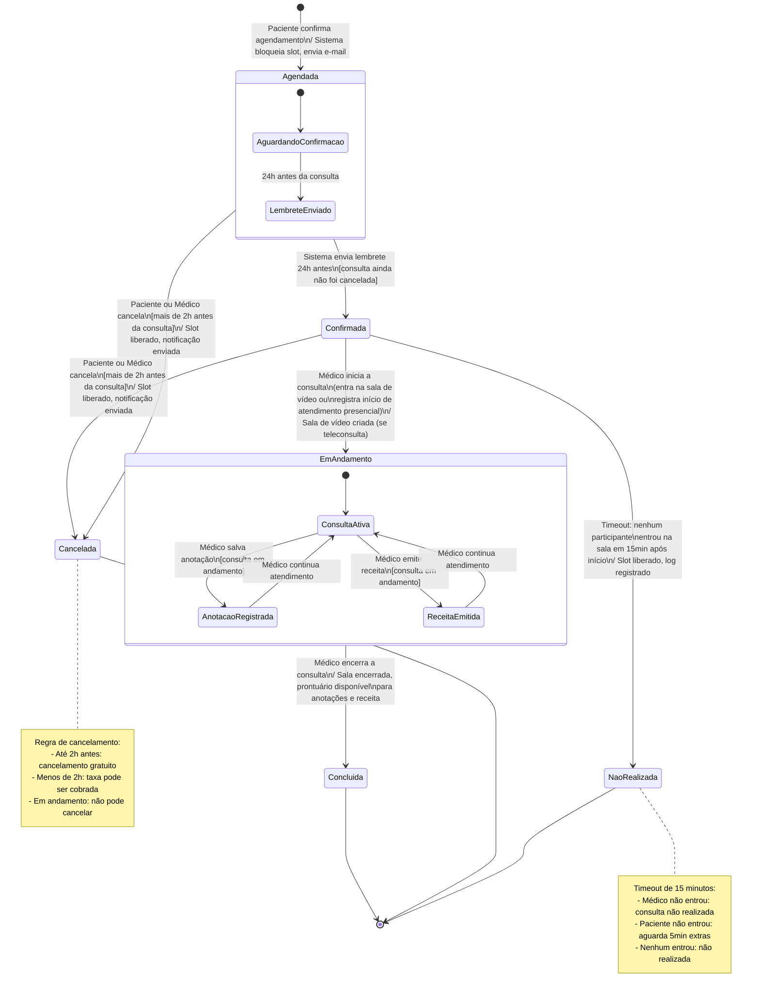

# 3. Modelagem Comportamental — Fatia 2

## Fatia 2: Ciclo de vida da consulta

**Tipo de diagrama escolhido: Diagrama de Estados**

**Justificativa:** Escolhemos o diagrama de estados para esta fatia porque o objeto central — a `Consulta` — possui um ciclo de vida claro, com estados bem definidos e transições disparadas por eventos com regras específicas. A riqueza dessa fatia está justamente em **quais transições são permitidas, quais são irreversíveis e o que acontece em situações de exceção** (não comparecimento, cancelamento tardio). Um diagrama de sequência aqui mostraria apenas um dos caminhos; o diagrama de estados mostra todos os caminhos possíveis e as guardas que os governam.

---

## Diagrama de Estados

---

## Notas sobre o diagrama

**Estado composto `Agendada`:** Dentro do estado `Agendada`, modelamos a transição interna de envio de lembrete — o estado externo permanece `Agendada`, mas internamente o sistema registra que o lembrete foi enviado, evitando duplicações.

**Estado composto `EmAndamento`:** Dentro de `EmAndamento`, o médico pode registrar anotações e emitir receita múltiplas vezes (o estado retorna para `ConsultaAtiva` após cada ação). Isso reflete que a consulta permanece em andamento enquanto essas ações ocorrem.

**Transição irreversível:** Uma vez em `EmAndamento`, a consulta não pode mais ser cancelada. Essa é a regra de negócio mais crítica — garante que não haja cancelamentos durante atendimentos em curso.

**Guarda de cancelamento:** A guarda `[mais de 2h antes da consulta]` representa a regra de cancelamento sem custo. O sistema deve calcular a diferença entre o instante atual e `data_realizacao` para determinar se o cancelamento é permitido ou se há cobrança de taxa.

**Eventos de timeout:** O estado `NaoRealizada` é atingido por timeout do sistema (15 minutos), não por ação direta de um usuário — isso evidencia que o sistema tem comportamento autônomo além das ações dos atores.
