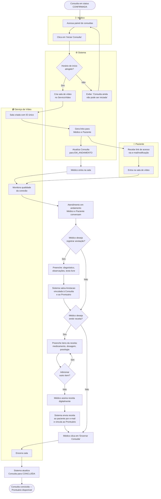

# 3. Modelagem Comportamental — Fatia 3

## Fatia 3: Médico conduz teleconsulta, registra anotações e emite receita

**Tipo de diagrama escolhido: Diagrama de Atividades**

**Justificativa:** Escolhemos o diagrama de atividades para esta fatia porque o fluxo envolve **decisões condicionais**, **ações paralelas** e **múltiplos atores em raias distintas** (médico, paciente e sistema de vídeo). O médico conduz o atendimento, o paciente participa passivamente na sala, e o sistema de vídeo opera em paralelo gerenciando a conexão. Ao final, há uma bifurcação: o médico decide se emite ou não uma receita, e se registra ou não anotações — ambas são opcionais mas têm regras. Um diagrama de atividades com swimlanes deixa visível quem faz o quê e em que ordem, o que um diagrama de estados não capturaria com a mesma clareza.

---

## Diagrama de Atividades

---

## Notas sobre o diagrama

**Swimlanes (raias):** O diagrama usa quatro raias — Médico, Sistema, Paciente e Serviço de Vídeo. Isso torna explícito que a criação da sala e o envio de links acontecem no sistema, enquanto o médico e o paciente aguardam. A separação de responsabilidades é visível sem necessidade de texto adicional.

**Validação de horário:** A atividade `valida_horario` representa uma regra de negócio real — o sistema não deve permitir que o médico inicie uma consulta antes do horário marcado (com uma janela de tolerância de, por exemplo, 5 minutos).

**Anotação e receita são opcionais e independentes:** O fluxo modela ambas como decisões separadas. O médico pode registrar uma anotação sem emitir receita, emitir receita sem anotação, ambas, ou nenhuma. Isso reflete a realidade clínica onde nem toda consulta resulta em prescrição.

**Loop de itens de receita:** O nó `add_item` com retorno para `preenche_receita` representa que uma receita pode conter múltiplos medicamentos, cada um com dosagem e posologia específicas — mapeando diretamente para a classe `ItemReceita` do diagrama de classes.

**Integração com `ServicoVideo`:** A raia de serviço de vídeo isola a dependência externa. Se o serviço de vídeo falhar, o impacto é contido — o sistema pode tratar o erro na transição `cria_sala → sala_criada` sem afetar o restante do fluxo (consulta presencial não passa por essa raia).
